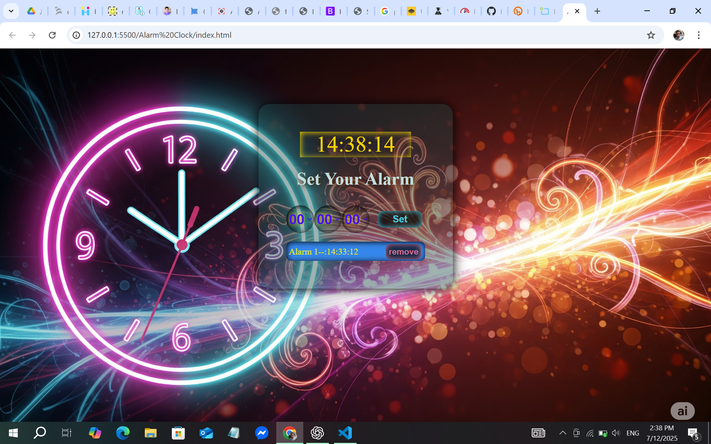

# ⏰ Alarm Clock Web App

A responsive and interactive Alarm Clock built with **HTML**, **CSS**, and **JavaScript**. Users can set alarms with hour, minute, and second precision, and get notified with a sound alert when the alarm time is reached.

---

## 🔗 Live Preview

🌐 [Click to view live](https://nafis-cse.github.io/alarm-clock)

---

## 📸 Screenshots

### 🖥️ Desktop View



### 📱 Mobile View


---

## 🛠️ Technologies Used

- HTML5  
- CSS3  
- JavaScript (Vanilla)  
- Local Storage

---

## 🎯 Features

- ⏱ Real-time digital clock display  
- 🔔 Set alarm for specific time (HH:MM:SS)  
- 💾 Alarms saved in `localStorage`  
- 🗑 Remove alarms individually  
- 🔁 Alarm rings with `audio.mp3` at exact time  
- 📱 Responsive UI for all screen sizes

---

## 📂 Folder Structure

```
alarm-clock/
│
├── index.html
├── style.css
├── script.js
├── README.md
├── img_&_audio/
│   ├── imag.png
│   └── audio.mp3
└── screenshots/
    ├── desktop.png
    └── mobile.png
```

---

## 🚀 How to Run Locally

1. Clone this repository:
   ```bash
   git clone https://github.com/Nafis-CSE/alarm-clock.git
   ```
2. Open the folder and run `index.html` in your browser  
3. Set an alarm and wait for the ring!

---

## 🔉 Credits

- 🔊 Alarm Sound: `audio.mp3` in `img_&_audio/` folder  
- 🎨 UI and functionality: Designed and built by **Nafis**

---

## 👤 Author

**Nafis**  
📧 Email: shahariyarnafis4700@gmail.com  
🌐 [Portfolio Website](https://nafis-cse.github.io/portfolio)  
🐙 [GitHub Profile](https://github.com/Nafis-CSE)

---

## 📌 License

This project is open-source and free to use.
